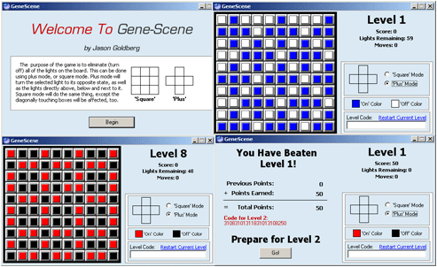



## GeneScene \- Gene Simulation Game

### Description

The purpose of the game is to eliminate (turn off) all of the lights on the board. This can be done using 'plus' mode, or 'square' mode. Plus mode will turn the selected light to its opposite state, as well as the lights directly above, below and next to it. Square mode will do the same thing, except the diagonally touching boxes will be affected, too.

Game is complete with color options, and a level-jumper, so you can return to any level you have previously achieved if you dont want to play the whole game all the way through. There are 11 levels and it is REALLY easy to add more levels. No external files. 14K. Check it out. If you can beat this game I will be impressed as all heck. This game is HARD.
 
### More Info
 

             |
---                |---
**Submitted On**   |2004-09-22 09:25:12
**By**             |[\[\]\)utch\[\]v\[\]aster](https://github.com/Planet-Source-Code/PSCIndex/blob/master/ByAuthor/utch-v-aster.md)
**Level**          |Intermediate
**User Rating**    |4.7 (14 globes from 3 users)
**Compatibility**  |VB 5\.0, VB 6\.0
**Category**       |[Games](https://github.com/Planet-Source-Code/PSCIndex/blob/master/ByCategory/games__1-38.md)
**World**          |[Visual Basic](https://github.com/Planet-Source-Code/PSCIndex/blob/master/ByWorld/visual-basic.md)
**Archive File**   |[GeneScene\_1796499222004\.zip](https://github.com/Planet-Source-Code/utch-v-aster-genescene-gene-simulation-game__1-56305/archive/master.zip)

